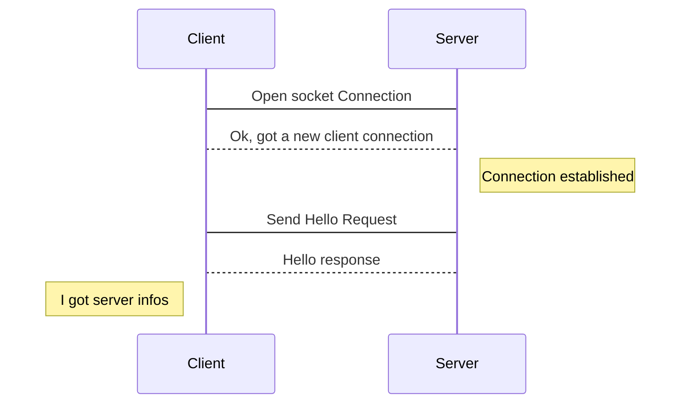
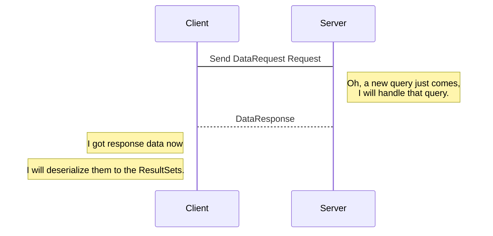
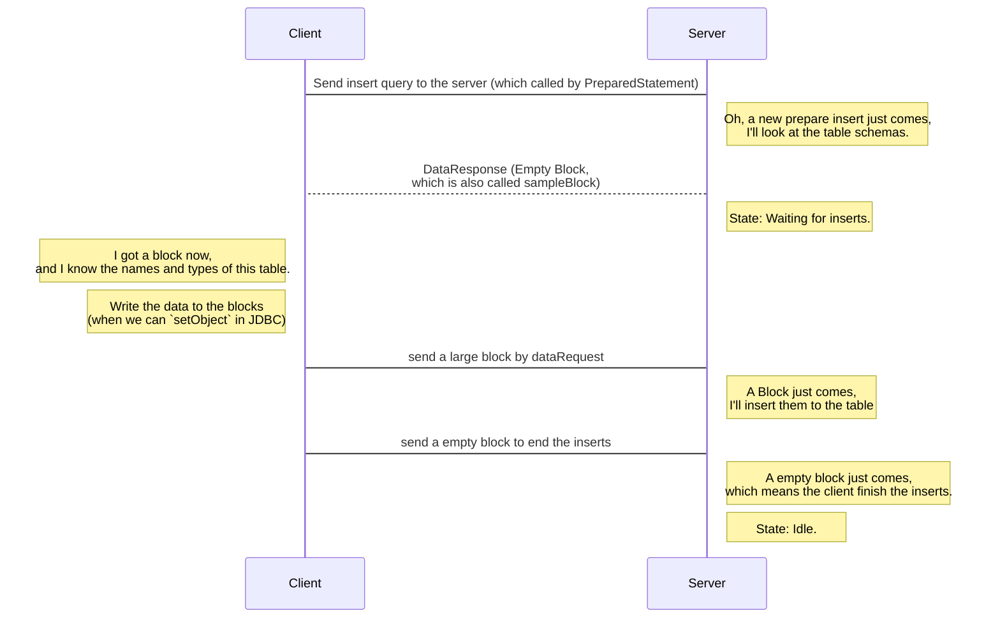

ClickHouse C/S Native Protocol
===

## Connection

## Request

- There are many kinds of requests/response, the above `hello` is one of them.

- You can find all the request/response type in `com.github.housepower.jdbc.protocol` package.

## Query

After the connection established and hello request/response, we can send plain sql strings to query the data. 

## Insert

The plain query which send sql literal to the server, but it's not efficient for batch inserts. ClickHouse provides another type of data request for batch inserts that we can send blocks to the server directly.

 

