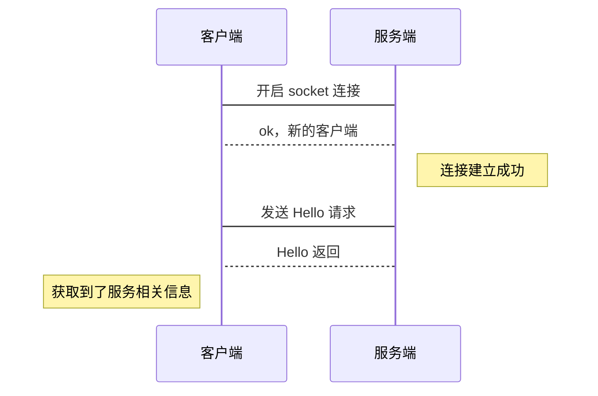
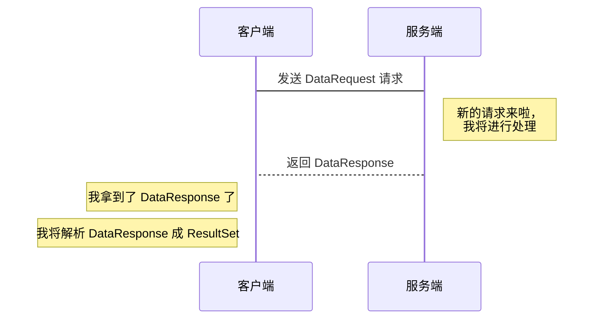
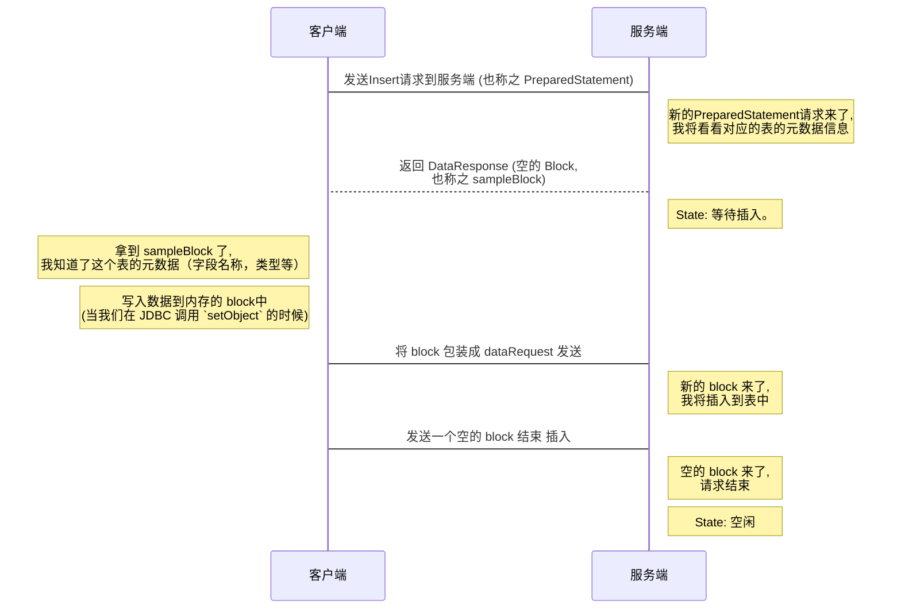

ClickHouse 客户端-服务端原生通信协议
===

## 建立连接

## 发请请求

- 请求有非常多种不同的 requests/response, 上述 `hello` 为其中一种。

- 可以在 `com.github.housepower.jdbc.protocol` 包下面找到所有的 requests/response 类型。

## 查询

当连接建立并且经过 hello请求返回后，我们可以发送一个字符串SQL来查询数据。

## 插入

一些小的查询请求，可以以字符串SQL的方式和服务端交互，但这不利于批量数据的插入。ClickHouse 提供了另外原生的批量导入协议支持，这样我们可以直接往ClickHouse发送block数据。

 

